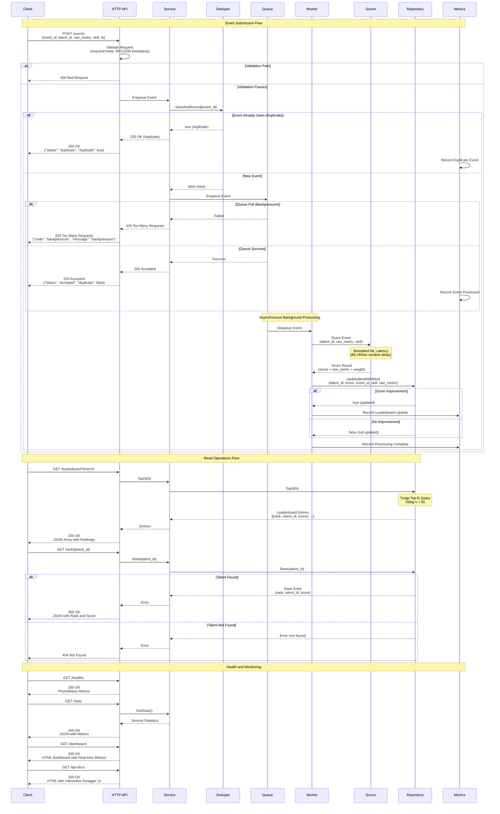

# CUJU Event Flow Sequence Diagram

## Complete Event Processing Flow



## Key Components Interaction

### 1. Event Processing Pipeline
1. **Validation**: HTTP API validates request format and required fields
2. **Deduplication**: Service checks if event_id was already processed
3. **Queuing**: New events are enqueued for asynchronous processing
4. **Scoring**: Workers process events with simulated ML latency
5. **Storage**: Repository updates leaderboard with improved scores
6. **Metrics**: All operations are tracked for monitoring

### 2. Read Operations
1. **Leaderboard**: Treap-based top-N query with in-order traversal
2. **Rank Lookup**: Single treap rank calculation
3. **Caching**: Periodic snapshots provide fast access to top entries

### 3. Error Handling
- **Validation Errors**: 400 Bad Request for malformed requests
- **Duplicate Events**: 200 OK with duplicate flag
- **Not Found**: 404 for non-existent talents
- **Backpressure**: 429 Too Many Requests when queue is at capacity

### 4. Performance Characteristics
- **Event Submission**: O(1) - Hash map lookup + channel send
- **Leaderboard Query**: O(log n + N) - Treap in-order traversal
- **Rank Lookup**: O(log n) - Single treap rank calculation
- **Health Check**: O(1) - Simple status check

## Data Flow Summary

```
Client Request → HTTP API → Service → Components → Response
     ↓              ↓         ↓          ↓           ↓
  JSON Event → Validation → Dedupe → Queue → 202 Accepted
     ↓              ↓         ↓          ↓           ↓
  Read Query → Service → Repository → Treap → JSON Response
     ↓              ↓         ↓          ↓           ↓
  Health Check → Service → Status → Metrics → 200 OK
```

This sequence diagram illustrates the complete flow from user request to leaderboard storage, showing all the key components, their interactions, and the asynchronous nature of event processing.
